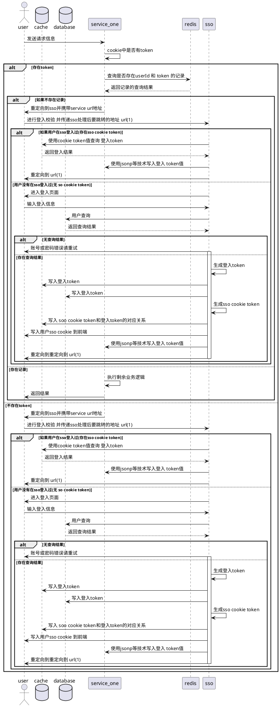

### magic-sso

#### 系统依赖

```xml
<?xml version="1.0" encoding="UTF-8"?>
<project xmlns="http://maven.apache.org/POM/4.0.0"
         xmlns:xsi="http://www.w3.org/2001/XMLSchema-instance"
         xsi:schemaLocation="http://maven.apache.org/POM/4.0.0 http://maven.apache.org/xsd/maven-4.0.0.xsd">
    <modelVersion>4.0.0</modelVersion>

    <groupId>com.magic</groupId>
    <artifactId>sso</artifactId>
    <version>1.0-SNAPSHOT</version>
    <dependencies>
        <dependency>
            <groupId>io.undertow</groupId>
            <artifactId>undertow-core</artifactId>
            <version>2.0.15.Final</version>
        </dependency>
        <dependency>
            <groupId>io.undertow</groupId>
            <artifactId>undertow-servlet</artifactId>
            <version>2.0.15.Final</version>
        </dependency>
        <dependency>
            <groupId>io.undertow</groupId>
            <artifactId>undertow-websockets-jsr</artifactId>
            <version>2.0.15.Final</version>
        </dependency>
        <!-- https://mvnrepository.com/artifact/org.jboss.logging/jboss-logging -->
        <dependency>
            <groupId>org.jboss.logging</groupId>
            <artifactId>jboss-logging</artifactId>
            <version>3.3.2.Final</version>
        </dependency>
        <!-- https://mvnrepository.com/artifact/org.jboss.logging/jboss-logging-processor -->
        <dependency>
            <groupId>org.jboss.logging</groupId>
            <artifactId>jboss-logging-processor</artifactId>
            <version>2.1.0.Final</version>
            <scope>provided</scope>
        </dependency>
        <dependency>
            <groupId>io.undertow</groupId>
            <artifactId>undertow-websockets-jsr</artifactId>
            <version>2.0.15.Final</version>
        </dependency>
        <!-- https://mvnrepository.com/artifact/org.apache.logging.log4j/log4j-slf4j-impl -->
        <dependency>
            <groupId>org.apache.logging.log4j</groupId>
            <artifactId>log4j-slf4j-impl</artifactId>
            <version>2.11.1</version>
        </dependency>
        <!-- https://mvnrepository.com/artifact/com.alibaba/druid -->
        <dependency>
            <groupId>com.alibaba</groupId>
            <artifactId>druid</artifactId>
            <version>1.1.12</version>
        </dependency>

        <!-- https://mvnrepository.com/artifact/org.mybatis/mybatis -->
        <dependency>
            <groupId>org.mybatis</groupId>
            <artifactId>mybatis</artifactId>
            <version>3.4.6</version>
        </dependency>
        <!-- https://mvnrepository.com/artifact/mysql/mysql-connector-java -->
        <dependency>
            <groupId>mysql</groupId>
            <artifactId>mysql-connector-java</artifactId>
            <version>8.0.13</version>
        </dependency>
    </dependencies>
    <build>
        <plugins>
            <plugin>
                <groupId>org.apache.maven.plugins</groupId>
                <artifactId>maven-compiler-plugin</artifactId>
                <version>3.8.0</version>
                <configuration>
                    <source>1.8</source>
                    <target>1.8</target>
                </configuration>
            </plugin>
        </plugins>
    </build>
</project>
```

> 从体系结构上来看主要依赖jboss 的 undertow ,alibaba 开源数据库连接池

#### 单点登入架构设计

#### 需求统计

1. 多用户登入的存储
2. 跨域登入

##### 1. 初次登入业务流程图




